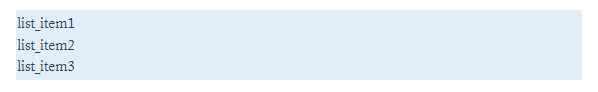
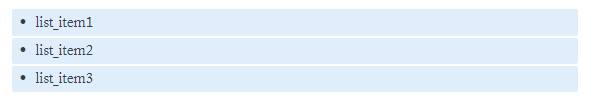

# text-modification-for-notion
This repository contain some module &amp; functions that can be useful to automate process on editing text that will be pasted on `Notion` (a productivity app).

## Description
`Notion` is a freemium productivity and note-taking web application developed by Notion Labs Inc. It offers organizational tools including task management, project tracking, to-do lists, bookmarking, and more.

But there is a problem with Notioin. Often we want to paste text from a text editor into the Notion app but we get bad formatting when the text is pasted. For example when we want to paste a list that we separate each item with a new line like this:

  ```sh
list_item1
list_item2
list_item3
  ```

When we paste it directly into the notion, the list will gather into a block of text, like this:



This is an unwanted condition for us. So the solution to this problem is to add several characters, for example by adding a bullet at the beginning of each item, like following:

  ```sh
- list_item1
- list_item2
- list_item3
  ```
The result on notion will be like this:



But it would be very **tiring** if we add bullets one by one for each item manually. Therefore it is necessary to do **automation**.

## Prerequisites

This repository only have 1 dependencies, which is `pytube`, so you can install it by regular pip command :
```
pip install pytube
```
or by installing requirements.txt
```
pip install -r requirements.txt
```

## Getting Started

1. Open and modify the text in `files/input.txt` with the text you want to modify.
2. Open `main.py` and modify the code. For example i want to add bullet for each item, then i will add this code:
  ```
  notion_modifier(input_filename, output_filename, 'add_bullet')
  ```
3. Run `main.py`. If it's successful, the result will be in `files/output.txt`

## Features
* **Add New Line**

  Double the new line

  ```
  notion_modifier(input_filename, output_filename, 'add_newline')
  ```
* **Add Bullet**

  Add bullet at the start of each line
  
  ```
  notion_modifier(input_filename, output_filename, 'add_bullet')
  ```
* **Add Number**

  Add number at the start of each line

  ```
  notion_modifier(input_filename, output_filename, 'add_number')
  ```
* **Normalize Notion Link**
  
  To give more information about a youtube link, by adding the title and the channel name 
  
  ```
  notion_modifier(input_filename, output_filename, 'normalize_notion_link')
  ```
  
  * Input:
  
  ```
  - https://www.youtube.com/watch?v=gGGPTskb7c8
  - https://www.youtube.com/watch?v=lKr3wa24NFg
  ```
  
  * Output:
  
  ```
  - https://www.youtube.com/watch?v=gGGPTskb7c8 Starting A Serious Web Development Project - Traversy Media
  - https://www.youtube.com/watch?v=lKr3wa24NFg What is a deep learning architect and the interview process. With Adam Grzywaczewski (NVIDIA) - What's AI by Louis Bouchard
  ```
